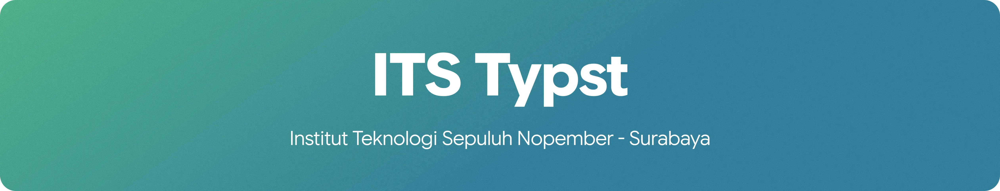

  

**Kenapa Typst?** Plain text, tidak seribet LaTeX, dan tidak bakal tiba-tiba format-nya geser sendiri kayak Word. Karena plain text juga, gampang dipakai bareng AI agent untuk bantu nulis.

**Mau ikut bantu?** Fork repo yang relevan dan ajukan Pull Request. Ada bug atau mau request template baru? Buka **[Issues](https://github.com/ITS-Typst/ITS-Typst/issues)** di repo ini.

Dikelola oleh mahasiswa untuk mahasiswa ITS. Bukan produk resmi Institut Teknologi Sepuluh Nopember.

